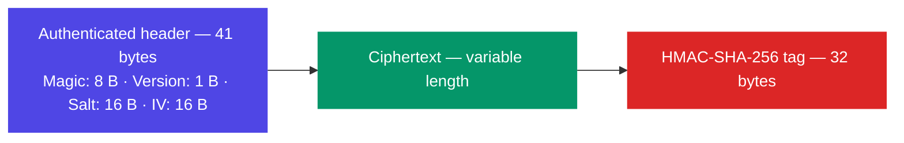
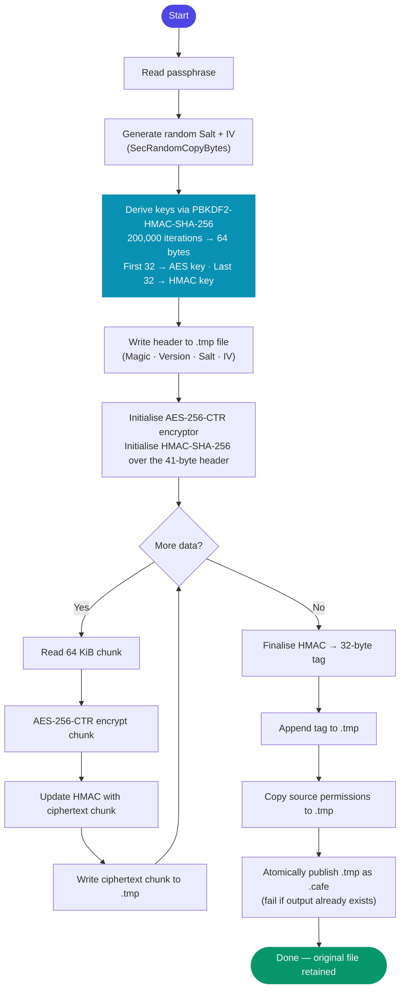
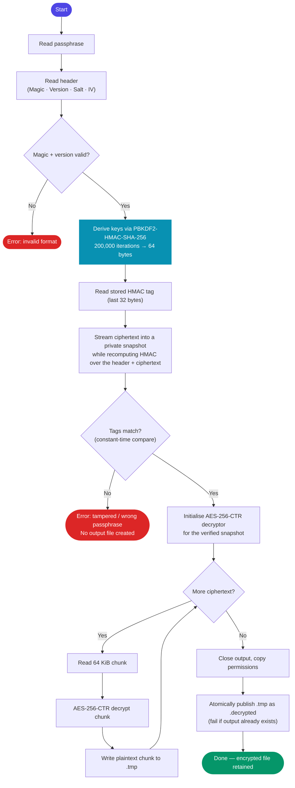
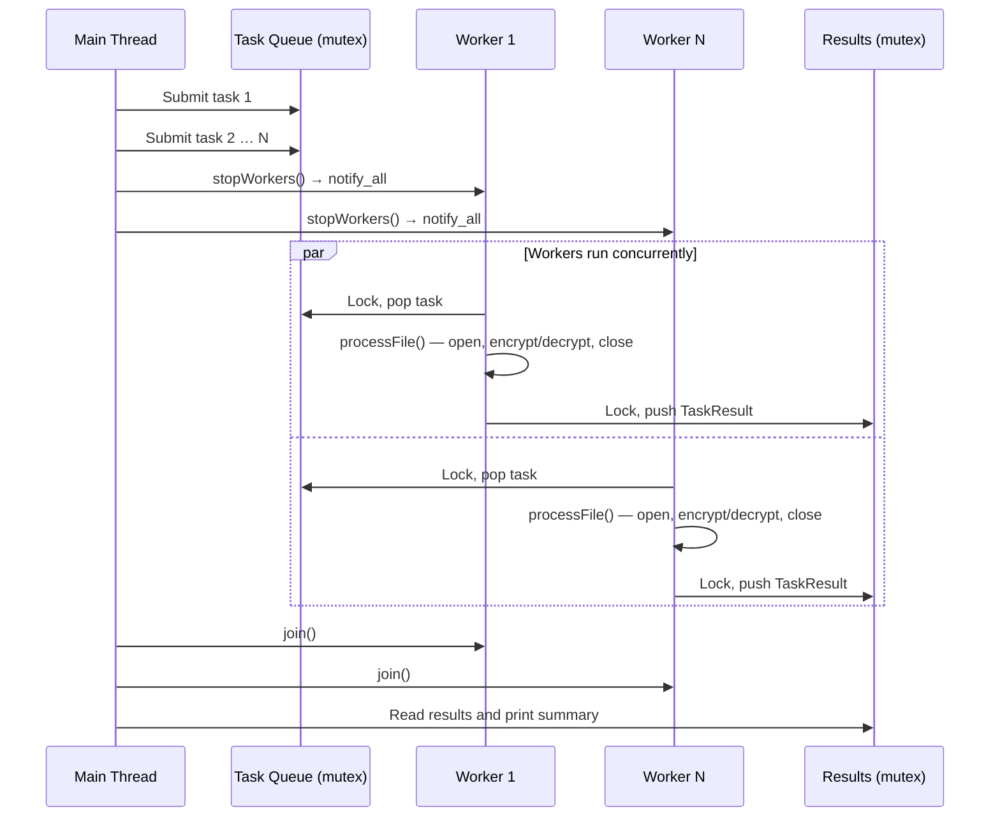
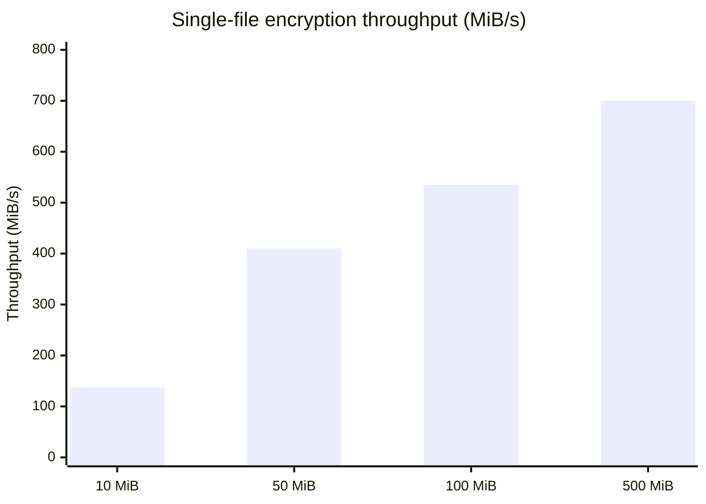

# Concurrent Authenticated File Encryption

Concurrent Authenticated File Encryption is a macOS command-line utility that encrypts or decrypts one file or every eligible file beneath a directory. It is written in C++17 and uses Apple CommonCrypto and Security APIs.

The tool is designed to be non-destructive: encryption leaves the original file in place, decryption leaves the encrypted file in place, and it never replaces an existing output path.

> This is a portfolio project, not an independently audited security product. Do not rely on it as the only protection for sensitive or irreplaceable data.

## Features

- Encrypts a single regular file or recursively processes a directory.
- Uses AES-256 in CTR mode to transform file contents.
- Authenticates encrypted data with HMAC-SHA-256 (encrypt-then-MAC), detecting tampering and wrong passphrases before plaintext is written.
- Generates a new cryptographically random salt and IV for every encrypted file.
- Derives distinct 256-bit encryption and authentication subkeys with PBKDF2-HMAC-SHA-256 and 200,000 iterations.
- Streams data in 64 KiB chunks, avoiding whole-file memory use.
- Processes files concurrently through a worker pool sized to the detected hardware concurrency.
- Creates owner-readable-and-writable temporary files, including a verified ciphertext snapshot during decryption; copies source permissions to successful output and cleans temporary files after an error.
- Skips temporary, decrypted, or already-encrypted files when they are not applicable to the requested action.

## Requirements

- macOS
- Xcode Command Line Tools (including the C++ compiler, CommonCrypto headers, and Security framework)
- `make`

The current build links against Apple's `Security` framework and uses CommonCrypto, so it is macOS-specific.

## Build

From the project root:

```sh
make
```

This produces the `encrypt_decrypt` executable. The build compiles:

- `main.cpp` — command-line parsing, target discovery, and reporting.
- `src/app/processes/ProcessManagement.cpp` — queue-based worker-pool implementation.
- `src/app/encryptDecrypt/Cryption.cpp` — file format, key derivation, authentication, encryption, and decryption.

To remove the executable and object files produced by the Makefile:

```sh
make clean
```

## Usage

```text
encrypt_decrypt <encrypt|decrypt> <path>
```

`<path>` may be a regular file or a directory. Directories are traversed recursively with `skip_permission_denied`; files that cannot be inspected are skipped, and iterator errors encountered during traversal are reported.

Provide the passphrase through the `CAFE_PASSPHRASE` environment variable to keep it out of the command line and shell history:

```sh
export CAFE_PASSPHRASE='use-a-long-unique-passphrase'
CAFE_PASSPHRASE='...' ./encrypt_decrypt encrypt ./documents
CAFE_PASSPHRASE='...' ./encrypt_decrypt decrypt ./documents
```

If the variable is unset, the tool prompts on standard error and reads from standard input. Terminal echo is suppressed while typing so the passphrase does not appear on screen. Empty passphrases are rejected.

### Encrypting a file

```sh
CAFE_PASSPHRASE='example-passphrase' \
  ./encrypt_decrypt encrypt ./notes.txt
```

The output is written beside the source file:

```text
notes.txt.cafe
```

The original `notes.txt` is retained.

### Decrypting a file

```sh
CAFE_PASSPHRASE='example-passphrase' \
  ./encrypt_decrypt decrypt ./notes.txt.cafe
```

The output is written beside the encrypted input:

```text
notes.txt.decrypted
```

The encrypted input is retained. This naming deliberately avoids replacing the original file.

### Directory behavior

For `encrypt`, regular files are selected except files whose extension is `.cafe`, `.decrypted`, or `.tmp`.

For `decrypt`, only regular files with the `.cafe` extension are selected. Files ending in `.tmp` or `.decrypted` are always skipped. Output paths that already exist are refused, and that file is reported as an error while other queued files continue.

Each processed file prints one status line (`OK` or `ERROR`), followed by a completion summary. The program exits with:

- `0` when all selected files complete successfully, including when none match.
- `1` when one or more file operations fail.
- `2` for invalid command usage, missing or unsupported paths, invalid actions, or an empty passphrase.

## Encrypted-file format

Every `.cafe` file uses the following binary layout:

| Field | Size | Purpose |
| --- | ---: | --- |
| Magic | 8 bytes | ASCII `CAFE    ` (padded to 8 bytes), identifying the file format |
| Version | 1 byte | Format version, currently `1` |
| Salt | 16 bytes | Random PBKDF2 salt |
| IV | 16 bytes | Random AES-CTR initialization vector |
| Ciphertext | variable | AES-256-CTR encrypted input bytes |
| Authentication tag | 32 bytes | HMAC-SHA-256 over the header and ciphertext |

The header is **41 bytes** (`8 + 1 + 16 + 16`) and includes the salt and IV. The salt and IV are generated with `SecRandomCopyBytes`. PBKDF2-HMAC-SHA-256 derives 64 bytes from the passphrase and salt: the first 32 bytes are the AES-256 key and the remaining 32 bytes are the HMAC key.

During decryption, the tool validates the magic and version, streams ciphertext into a private temporary snapshot while recomputing the HMAC, and compares tags in constant time. It only creates the plaintext temporary file after successful authentication, then decrypts the verified snapshot rather than re-reading the source path. A corrupted file or wrong passphrase therefore produces no decrypted output.



The HMAC covers the complete 41-byte header followed by the ciphertext; the tag itself is not included in its own calculation.

## Encryption flow



## Decryption flow



## Processing model

`ProcessManagement` maintains a mutex-protected queue and condition variable. It starts one worker per hardware-concurrency unit (falling back to one worker if the platform reports zero). The main thread discovers eligible paths and queues tasks, then requests shutdown and joins the workers. Workers continue taking queued tasks and exit only once the queue is empty.

Workers open their own files when a task begins. Directory traversal therefore does not keep a file descriptor open for every discovered file. Results are collected under a separate mutex; their display order can differ from discovery order because tasks run concurrently.

The passphrase is shared by tasks through a read-only `Passphrase` object. Its destructor overwrites the held string bytes, and derived key material is also overwritten on destruction.



## Output safety and permissions

For a target output, the tool first checks whether the final path already exists. It writes to `<output>.tmp` using exclusive creation with mode `0600`, copies the source file permissions to the temporary output, and atomically publishes it by creating a hard link at the final path. This no-clobber publication fails with `EEXIST` if another writer wins the race, so it cannot replace that writer's file. If an operation fails — including a buffered write error detected at `close()` time — the temporary output is removed and the error is reported.

The publish operation is not followed by an `fsync`, so a successfully reported result is not a power-loss durability guarantee.

Decryption authenticates a private ciphertext snapshot before creating this temporary plaintext file. This prevents unauthenticated data from being emitted for a tampered ciphertext, an incorrect passphrase, or a source file modified after authentication begins.

## Testing

Build the project and run the integration suite:

```sh
make
./tests/integration.sh
```

The test script creates an isolated temporary workspace and verifies:

- text and binary file round trips;
- preservation of original input data;
- preservation of a restrictive `0600` permission mode;
- single-file encryption and decryption;
- refusal to overwrite an existing output, with no leftover `.tmp` file;
- skipping of `.tmp` and `.decrypted` inputs during encryption; and
- rejection of modified ciphertext and incorrect passphrases without leftover plaintext, output-temp, or verification-snapshot files.

The `test/test1.txt` and `test/test2.txt` files are small sample text fixtures. The integration test itself generates its own temporary inputs, including a random binary file.

## Benchmarks

Measured on an **Apple M5** (10 logical cores, 16 GiB RAM) with a release build (`-O2`). Each scenario was run twice and averaged. The passphrase was fixed; PBKDF2 with 200,000 iterations dominates latency for small files.

### Per-file overhead (PBKDF2-dominated)

For files smaller than a few MiB, key derivation accounts for essentially all the wall-clock time regardless of file size.

| File size | Encrypt | Decrypt |
| ---: | ---: | ---: |
| 1 KiB | ~68 ms | ~61 ms |
| 64 KiB | ~60 ms | ~61 ms |
| 1 MiB | ~62 ms | ~62 ms |

### Single-file throughput

| File size | Encrypt time | Encrypt throughput | Decrypt time | Decrypt throughput |
| ---: | ---: | ---: | ---: | ---: |
| 10 MiB | ~73 ms | ~137 MiB/s | ~75 ms | ~134 MiB/s |
| 50 MiB | ~122 ms | ~410 MiB/s | ~132 ms | ~380 MiB/s |
| 100 MiB | ~187 ms | ~535 MiB/s | ~197 ms | ~510 MiB/s |
| 500 MiB | ~716 ms | ~700 MiB/s | ~767 ms | ~652 MiB/s |

### Concurrent multi-file throughput (100 × 1 MiB)

Each 1 MiB file incurs the ~62 ms PBKDF2 cost; the worker pool parallelises these across all 10 cores.

| Scenario | Encrypt | Encrypt rate | Decrypt | Decrypt rate |
| --- | ---: | ---: | ---: | ---: |
| 100 × 1 MiB files | ~700 ms | ~143 files/s | ~695 ms | ~144 files/s |



> **Note:** Throughput scales with file size because the fixed ~60 ms PBKDF2 overhead is amortised over more data. The AES-256-CTR + HMAC-SHA-256 ceiling on Apple Silicon is several GiB/s; the bottleneck at large sizes is disk I/O.

## Project layout

```text
.
├── Makefile
├── main.cpp
├── src/app/
│   ├── encryptDecrypt/
│   │   ├── Cryption.cpp       # CommonCrypto-based file operations
│   │   └── Cryption.hpp
│   ├── fileHandling/          # Reserved; currently empty
│   └── processes/
│       ├── ProcessManagement.cpp
│       ├── ProcessManagement.hpp
│       └── Task.hpp           # Task, result, action, and passphrase types
├── tests/integration.sh       # End-to-end test suite
└── test/                      # Small sample text files
```

After building, the root also contains `encrypt_decrypt` and compiler-generated `.o` object files. These are build artifacts rather than source files.

## Limitations

- macOS only; portability would require replacing the Apple cryptography APIs and framework linker flag.
- There is no key management, recovery mechanism, or passphrase confirmation.
- Existing output files are never overwritten automatically.
- Symlinks and non-regular filesystem entries are not processed.
- The code has not received an independent cryptographic security audit.
